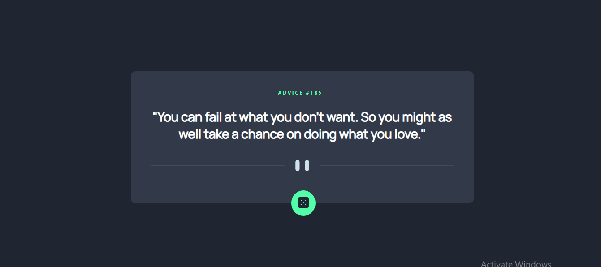

# Frontend Mentor - Advice generator app solution

This is a solution to the [Advice generator app challenge on Frontend Mentor](https://www.frontendmentor.io/challenges/advice-generator-app-QdUG-13db). Frontend Mentor challenges help you improve your coding skills by building realistic projects.

## Table of contents

- [Overview](#overview)
  - [The challenge](#the-challenge)
  - [Screenshot](#screenshot)
  - [Links](#links)
- [My process](#my-process)
  - [Built with](#built-with)
  - [What I learned](#what-i-learned)
  - [Continued development](#continued-development)
  - [Useful resources](#useful-resources)
- [Author](#author)

**Note: Delete this note and update the table of contents based on what sections you keep.**

## Overview

### The challenge

Users should be able to:
- View the optimal layout for the app depending on their device's screen size
- See hover states for all interactive elements on the page
- Generate a new piece of advice by clicking the dice icon
- 

### Screenshot

### Links

- Solution URL: [www.frontendmentor.io/solutions/axios-library-used-in-fetching-api-data-B1JSOJemq](https://www.frontendmentor.io/solutions/axios-library-used-in-fetching-api-data-B1JSOJemq)
- Live Site URL: [https://map-advice-generator.netlify.app/](https://map-advice-generator.netlify.app/)

## My process

### Built with

- CSS custom properties
- [React](https://reactjs.org/) - JS library
- [Axios](https://axios-http.com/docs/intro/) - API library
- [Styled Components](https://styled-components.com/) - For styles

### What I learned

I learnt how I can make SVG elements responsive by using viewbox attribute, among other things I learnt

### Continued development

I hope to learn more about fetching data from all API types. I also hope to improve in handling interactions between the user and my future apps

### Useful resources

- [w3 media queries](https://www.w3schools.com/css/css_rwd_mediaqueries.asp) - This helped me in making the app responsive. I really liked this pattern and will use it going forward.
- [Styled components](https://styled-components.com/docs) - This is an amazing tool which helped me in styling components inside my react app. I'd recommend it to anyone working with react.

## Author

- Website - [Michael Adejumo](https://silly-leavitt-18ea94.netlify.app/)
- Frontend Mentor - [@drealmap](https://www.frontendmentor.io/profile/drealmap)
- Twitter - [@drealmap](https://www.twitter.com/drealmap)